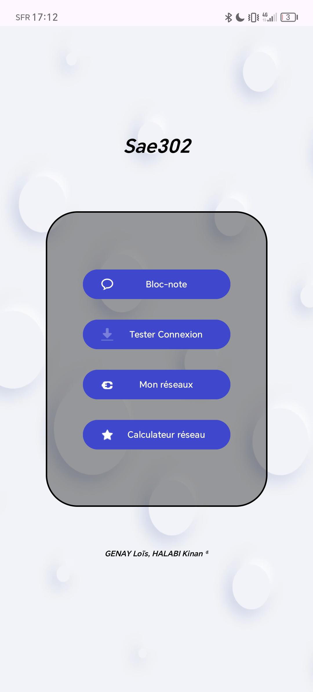
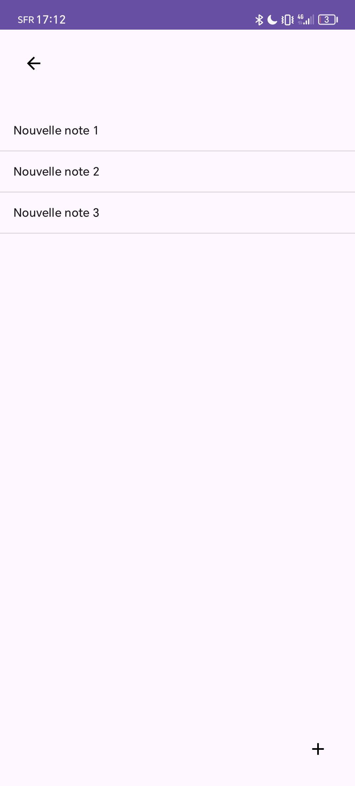
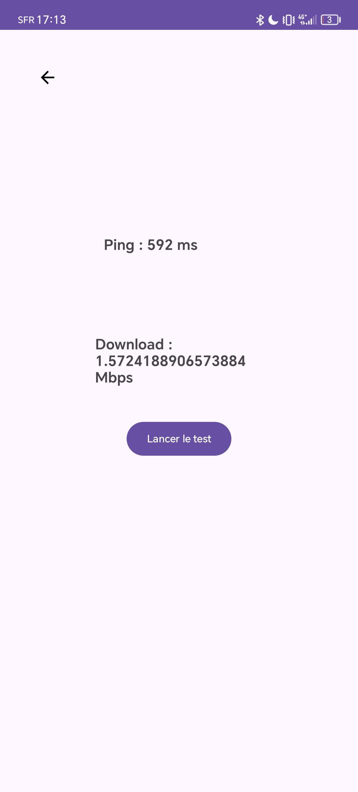

# Saé-3.2 : Développer des applications communicantes

## 📱 Projet

Le projet consiste à créer un prototype d'application Android qui pourrait être utile dans notre vie professionnelle future. Cette application offre plusieurs fonctionnalités liées aux réseaux informatiques.

---

## 🎯 Objectifs

- **Visualiser l'intensité du signal Wi-Fi** : Permet de vérifier la qualité de la connexion Wi-Fi en temps réel.
- **Afficher les caractéristiques réseau d'une adresse IPv4 donnée** : Calcul de l'adresse réseau, du masque de sous-réseau, de la passerelle et de la plage d'adresses utilisables en fonction d'un CIDR donné.

---

## ⚙️ Fonctionnalités principales

1. **Bloc-note :**
   - Pouvoir saisir une nouvelle note
   - Editer une note
   - Sauvegarder une note
   - Effacer une note
  
2. **Speed test :**
   - Pouvoir tester la latence de mon réseau
   - Controler notre vitesse de téléchargement

3. **Analyse du réseau Wi-Fi :**
   - Affichage de l'intensité du signal Wi-Fi.
   - Informations sur le SSID et la bande utilisée.

4. **Calculateur réseau IPv4 :**
   - Saisie des quatre octets d'une adresse IPv4 et du CIDR (par exemple : `192.168.1.1/24`).
   - Validation des entrées pour s'assurer de leur validité (octets entre 0 et 255, masque CIDR entre 0 et 32).
   - Affichage des informations suivantes :
     - Masque de sous-réseau.
     - Adresse réseau.
     - Passerelle par défaut (première adresse utilisable).
     - Plage d'adresses utilisables.
     - Adresse de diffusion.

## 🪖 Contrainte


1. **Interface multilingue :**
   - Support des langues **français** et **anglais** via des fichiers `strings.xml`.
   - La langue par défaut est l'anglais, avec une option pour basculer en français.

2. **Application multipages :**
   - Navigation simple entre les différentes sections grâce à un menu.

---

## 🚀 Contraintes du projet

- Développement réalisé en **Java** sur **Android Studio**.
- Respect des bonnes pratiques de développement Android :
  - Utilisation exclusive de `ConstraintLayout` pour la mise en page.
  - Contenu multilingue défini dans les fichiers de ressources (`strings.xml`).
  - Application conforme au design material.
- Application fonctionnelle sur des appareils avec une API Android minimum 25.

---

## 🛠️ Technologies utilisées

- **Langage** : Java
- **Environnement de développement** : Android Studio
- **Conception d'interface** : ConstraintLayout
- **API Android** : API 25+

---

## 📸 Aperçu de l'application

### Page 1 : Page de connexion


- à compléter

### Page 2 : Menu de l'application



- Affiche le menu pour selectionner ce que l'on veut faire avec l'appli
- un background annimé avec des bulles

### Page 3 : Un bloc-note



- gggg

### Page 4 : Un speed test


- gggg

### Page 5 : Un analyseur wifi


- gggg

### Page 6 : Un calculateur réseau



- gggg


---

## 🔄 Améliorations futures

- Ajout d'une fonctionnalité de sauvegarde des calculs réseau.
- Intégration d'une fonctionnalité de diagnostic réseau.
- Support d'autres protocoles réseau comme IPv6.
- Création d'un historique pour les adresses IP consultées.

---

## 📋 Installation

1. Télécharger [Android Studio](https://developer.android.com/studio).
2. Cloner ce dépôt GitHub pour les instructions et télécharger l'apk :
   ```bash
   git clone https://github.com/lolosk/Sae-3.2.git
3. Télécharger [Le projet](https://drive.google.com/file/d/1cT4zfW1PPQlL00OJwgBsUTBVeSV13Wli/view?usp=sharing).


